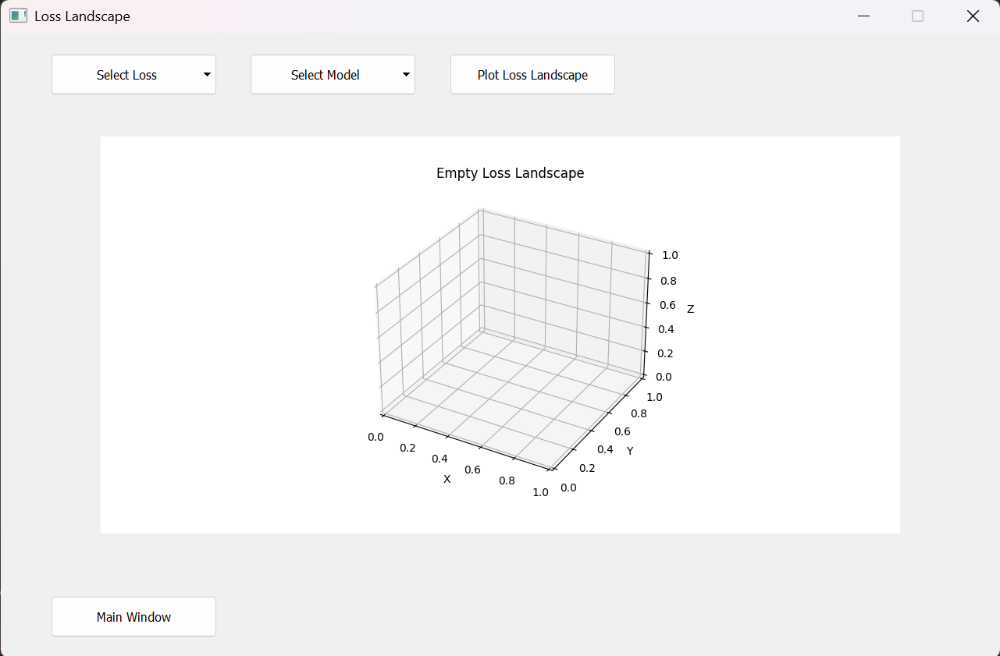

#  Welcome to our README
## How to use it ?
**run the main.py**

you can see our presentation as a markdown file directly on github by clicking *presentation.md* it is part of the readme as it gives an overview of mostly what has been done
or in vscode right-click on the "diapo.md" file and "Open Preview" to view our presentation of this project.
(might need marp extension on vscode)

Before running main.py, please ensure that you have a virtual environment ready
if some packages needed are missing from your env, type "yes" in the terminal to download them
here's an example of what it would look like :
> Missing packages: ['numpy==1.23.5', 'pandas==1.5.3  # Adjust to latest stable version as needed']  
> Some packages are missing. Do you want to install them? (yes/no):

once this has been done, the main window of our graphical interface should open.
it will look mostly like page 9 of our presentation, i.e   

To better interact with the functionalities, you need to provide the datafiles needed.  
in the "Select MD data file" you should put "NP_1200K_desc.pkl"  
and in the "Select Theta file" : "theta.pkl" preferably or "theta_md.pkl"  
(like in main_interface.png) 

in the "descriptor name" choose (once data are loaded) : *milady-descriptors*
"forces" : *forces* (not really original)
"descriptor gradient name" : *milady-descriptors-forces*
follow the previous image if needed

## Purpose 

The applications was designed for researchers from the CEA Paris-Saclay working on the prediction 
of molecular dynamics. 
Their goal is to train a prediction model using the Fisher Divergence metric instead of the RMSE.
However, training the model with this metric would take too long because of the complex formulas
that are used for computing gradients. We will instead fine-tune the model by adding a linear
layer that uses the descriptors found for the optimized $\theta$ to calculate $\theta_f$.

## Loss Landscape button

The "Loss Landscape" button, located in the bottom left corner, allows users to switch to a 
second window where they can plot the loss landscape for a selected model and loss function.
  

Initially, no model or loss function is selected. If the user attempts to plot the loss 
landscape without selecting these parameters, an error message will be displayed.

Once a model and a loss function are selected, their names will appear in the corresponding 
boxes, and the loss landscape functionality will be enabled.

The two varying weights for the loss landscape are selected randomly. As a result, if the 
user presses the "Loss Landscape" button multiple times without changing the model or loss 
function, the results will still vary.

On certain computers, a graphical bug may occur when displaying the loss landscape, causing 
a noise rectangle to appear next to the plot. This artifact often disappears if the user 
navigates back to the main window and then returns to the loss landscape window.

Returning to the main window does not erase the last generated loss landscape plot.

## What does it do ? (mathematical explaination)
### (warning, mostly math that explain what we are computing)
Let's consider a physical system of $N$ atoms $\mathbf{x} \in \mathbb{R}^{3N}$. In physics, we are very interested in knowing the Boltzmann distribution $p(\mathbf{x})$, which is the probability density function. This distribution allows us to understand the physics of the system and calculate quantities such as the free energy $F$:

$$
p(\mathbf{x}) = Z^{-1} e^{-\beta U(\mathbf{x})}
$$

and

$$
F = -\beta^{-1} \log Z
$$

where $Z$ is the partition function, $\beta^{-1} = k_B T$ is the inverse temperature, and $U(\mathbf{x})$ is the potential energy function.

The gradient of the log-density is the score of the Boltzmann distribution:

$$
s(\mathbf{x}) = \nabla_{\mathbf{x}} \log p(\mathbf{x}) = -\beta \nabla_{\mathbf{x}} U(\mathbf{x})
$$

This $3N$ dimensional gradient corresponds to the force field $-\nabla_{\mathbf{x}} U(\mathbf{x})$, scaled by $\beta$. Since $\nabla_{\mathbf{x}} U(\mathbf{x})$ (the forces) can be estimated or computed, with some effort we have access to $\nabla_{\mathbf{x}} \log p(\mathbf{x})$.

Similarly, consider a parametrized version of the probability distribution:

$$
p_{\boldsymbol{\theta}}(\mathbf{x}) = Z_{\boldsymbol{\theta}}^{-1} e^{-\beta U_{\boldsymbol{\theta}}(\mathbf{x})}
$$

with :

$$
Z_{\boldsymbol{\theta}} = \int e^{-\beta U_{\boldsymbol{\theta}}(\mathbf{x})} \, d\mathbf{x}
$$

Our goal is thus to find the optimal parameter $$\theta_{f}$$ that minimizes the Fisher divergence between $$p(\mathbf{x})$$ and $$p_{\theta_{f}}(\mathbf{x})$$.
Let's consider a D-dimensional linear machine learning model based on some descriptor functions and

$$
D(\mathbf{x}): \mathbb{R}^{3N} \rightarrow \mathbb{R}^D
$$

for which the energy can be written as:

$$
U_{\theta_{f}}(x) = \theta_{f}^{T} D(x)
$$ 

We aim to find the optimal parameter $$\theta_{f} \in \mathbb{R}^D$$ that minimizes the Fisher divergence between the true distribution $$p(\mathbf{x})$$ and the model distribution $$p_{\theta_{f}}(\mathbf{x})$$ where $$p_{\theta_{f}}(\mathbf{x}) = Z_{\theta_{f}} e^{-\beta \theta{f}^{T} D(\mathbf{x})}$$.

The Fisher divergence between $$p(\mathbf{x})$$ and $$p_{\theta_{f}}(\mathbf{x})$$ is:

$$
F(p, p_{\theta_{f}}) = 1/2 \int p(\mathbf{x}) |\nabla_{\mathbf{x}} \log p(\mathbf{x}) - \nabla_{\mathbf{x}} \log p_{\theta_{f}}(\mathbf{x})|^{2} d\mathbf{x}
$$

In the case of the Boltzmann distribution, the gradient of the log-density

$$
\nabla_{\mathbf{x}} \log  p(\mathbf{x}) = -\beta \nabla_{\mathbf{x}} U(\mathbf{x})
$$

somehow accessible for the points in the database as long as they are the atomic forces. 
Since forces can be computed, we can reformulate the score matching objective to avoid computing the Laplacian. By partial integration, we can easily obtain:

$$ J(\theta_{f}) = \mathbb{E}_{p(\mathbf{x})} \left[ (1/2) \left  s_{\theta_f}(\mathbf{x}) \right|^2 - s_{\theta_f}(\mathbf{x})^T \nabla_{\mathbf{x}} \log p(\mathbf{x}) \right] $$

Again, we can derive exactly the same form:

$$
J(\theta_{f}) = 1/2 \theta_{f}^{T} T \theta_{f} + \theta_{f}^{T} c
$$

where T is:

$$
T = (\beta^{2}/M) \sum_{m} G(\mathbf{x}_{m})^{T} G(\mathbf{x}_{m})
$$

and c  is:

$$
c = \mathbb{E}_{p(\mathbf{x})} \left[ \beta^{2} G(\mathbf{x})^{T} \nabla_{\mathbf{x}} U(\mathbf{x}) \right]
$$

 c  represents the expected inner product between the gradients of $D(\mathbf{x})$ and the force field $\nabla_{\mathbf{x}} U(\mathbf{x})$. 
 The optimal $\theta_f$ is formally:

$$
\theta_{f} = T^{-1} c
$$

and explicitly:

$$
\theta_{f} = \left( \mathbb{E}_{p(\mathbf{x})} \left[ G(\mathbf{x})^{T} G(\mathbf{x}) \right] \right)^{-1} \left( \mathbb{E}_{p(\mathbf{x})} \left[ G(\mathbf{x})^{T} \nabla_{\mathbf{x}} U(\mathbf{x}) \right] \right)
$$

We then use this new set of parameters to compute the new predicted energies (and the cumulative distribution function associated).
