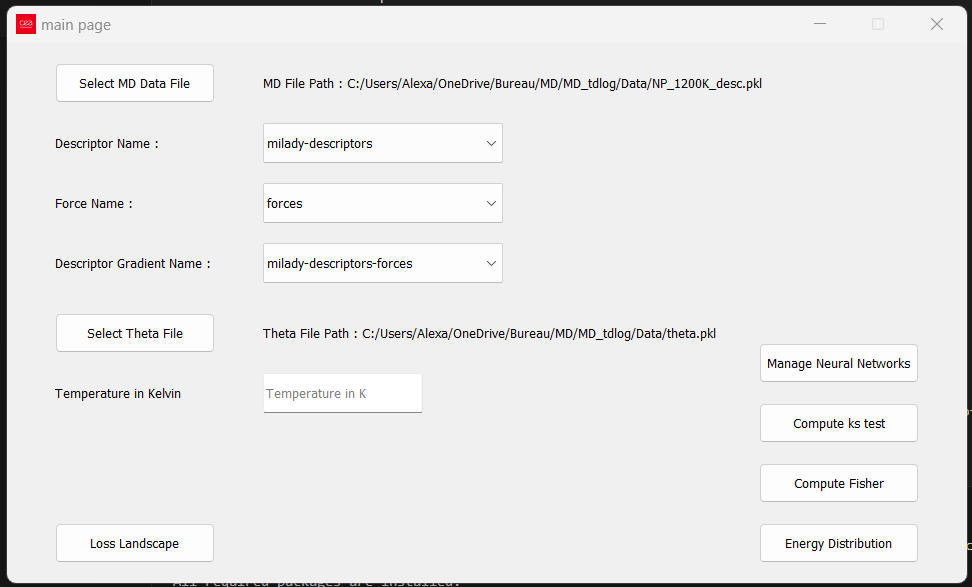

#  Welcome to our README
## How to use it ?
right-click on the "diapo.md" file and "Open Preview" to view our presentation of this project.
(might need marp extension on vscode)

Before running main.py, please ensure that you have a virtual environment ready
if some packages needed are missing from your env, type "yes" in the terminal to download them
here's an example of what it would look like :
> Missing packages: ['numpy==1.23.5', 'pandas==1.5.3  # Adjust to latest stable version as needed']  
> Some packages are missing. Do you want to install them? (yes/no):

once this has been done, the main window of our graphical interface should open.
it will look mostly like page 9 of our presentation, i.e   

To better interact with the functionalities, you need to provide the datafiles needed.  
in the "Select MD data file" you should put "NP_1200K_desc.pkl"  
and in the "Select Theta file" : "theta.pkl" preferably or "theta_md.pkl"  
(like in main_interface.png) 

## What does it do ?