<style>
section::after {
    /* Layout of pagination content */
    box-sizing: border-box;
    text-align: center;
    width: 120px;
    height: 120px;
    line-height: 40px;
    padding: 20px;

    /* Triangle background */
    background: linear-gradient(-45deg, rgba(0, 0, 0, 0.05) 50%, transparent 100%);
    background-size: cover;
  }
blockquote {
  background: #ffedcc;
  border-left: 10px solid #d1bf9d;
  margin: 1.5em 10px;
  padding: 0.5em 10px;
  color: #3b3b3b;
}
blockquote:before{
  content: unset;
}
blockquote:after{
  content: unset;
}
</style>

<!--- Welcome to our ReadMe, right-click on this md-file and "Open Preview" to this our presentation of this project --->
TDLOG & projet de département  
# Boltzmanian score matching fine-tuning  
K.Chikhaoui, T.Gospodaru, A.Dussolle  
<!-- 27/01/2025 -->


---

#### Sommaire : 
* I -   Objectifs initiaux 
* II -  Choix techniques
* III - Réalisation(s)
* IV -  Difficultés rencontrées
* V -   Perspectives d'extension

---
<style scoped>
section {
    font-size: 25px;
}
</style> 
<!-- si besoin d'écrire beaucoup -->
### I - Objectifs initiaux
*Contexte* : Comment stabiliser les simulations moléculaires faites par GNN ?
* mauvaise corrélation RMSE - time-stability
* meilleure stabilité "by smoothing the loss landscape" 
 \
\
semble arbitraire :  
idéalement Loss qui rapproche les gradients : Divergence de Fisher sur Boltzmann. 

$F(p,  p_{\theta}) = \frac{1}{2} \int p(\mathbf{x}) \left\| \nabla_{\mathbf{x}} \log p(\mathbf{x}) - \nabla_{\mathbf{x}} \log p_{\theta}(\mathbf{x}) \right\|^2 d\mathbf{x}$

---
D'abord restreint aux modèles linéaires, puis adaptation aux réseaux de neurones.
* Calculer modèle optimisant Fisher.
* Comparer les résultats RMSE/Fisher.  

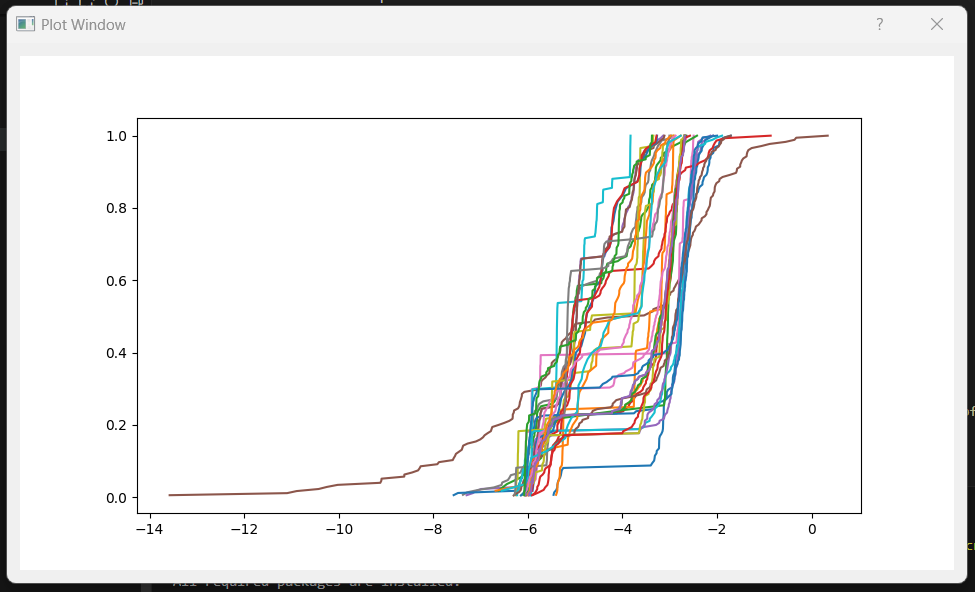 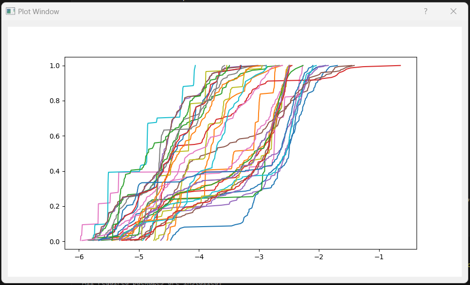

---

### II - Choix techniques
* Interface Qt plutôt qu'interface web : destiné à une utilisation locale des chercheurs
* Utilisation de Qt : bibliothèque très complète, beaucoup d'options pour les graphs (ex : intéractions)
* Utilisation de matplotlib : adapté pour les courbes et les landscapes, multiples options de personnalisation

---
* Orienté objet : Cohérence avec les bibliothèques utilisées, création de nouvelles classes pour les objets manipulés (dataholders, neural networks)
* Organisation du code en package python.


---
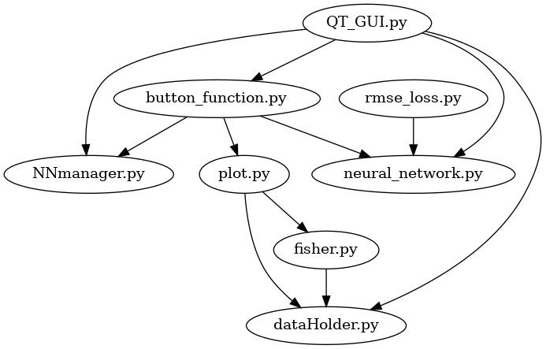


---
### III - Réalisation(s)
Installateur automatique des packages nécessaires
```python
def check_requirements(requirements_file="requirements.txt"):
    try:
        with open(requirements_file) as f:
            required_packages = [
                pkg.strip() for pkg in f if pkg.strip() and not pkg.startswith("#")
            ]

        missing_packages = []
        for pkg in required_packages:
            package_name = pkg.split(">=")[0]
            try:
                __import__(package_name)
            except ImportError:
                missing_packages.append(pkg)

        if missing_packages:
            ...
```

---
Interface graphique général
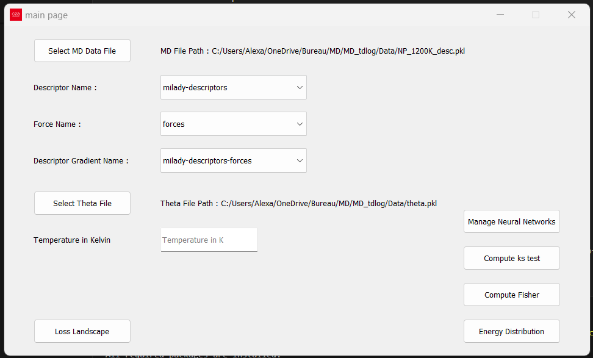

---
```python
class Window(QMainWindow):
        def __init__(self):
            super().__init__()
            self.create_ui()
            self.data = DataHolder()
            self.nn_manager = NNManager()
            self.loss_landscape_window = LossLandscapeWindow(self)
                   
        def create_ui(self):
            ...
            self.initlayout()
            self.show()

        def initlayout(self):
            self.create_buttons()
            self.create_labels()
            self.create_choices()
            self.create_imput_boxes()
```

<!-- --- -->
<!-- #### Création d'une interface Qt permettant la manipulation des données -->

---
##### Fenêtre Loss Landscape
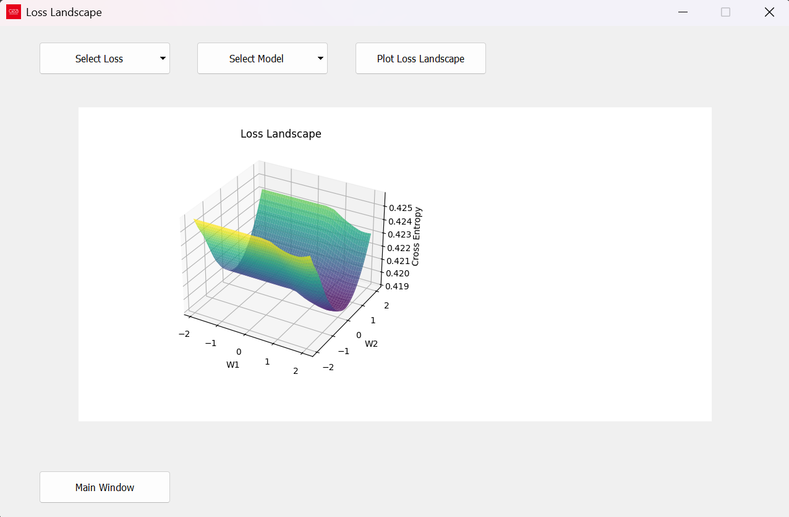

---
##### Fonctionnalités de Loss landscape
* Choisir un type de LOSS parmi : MSE, MAE, Hinge Loss et Cross Entropy
* Choisir un réseau de neurones : SimpleMPL, DoubleMLP, ...
* Loss Landscape pour 2 paramètres aléatoires

---

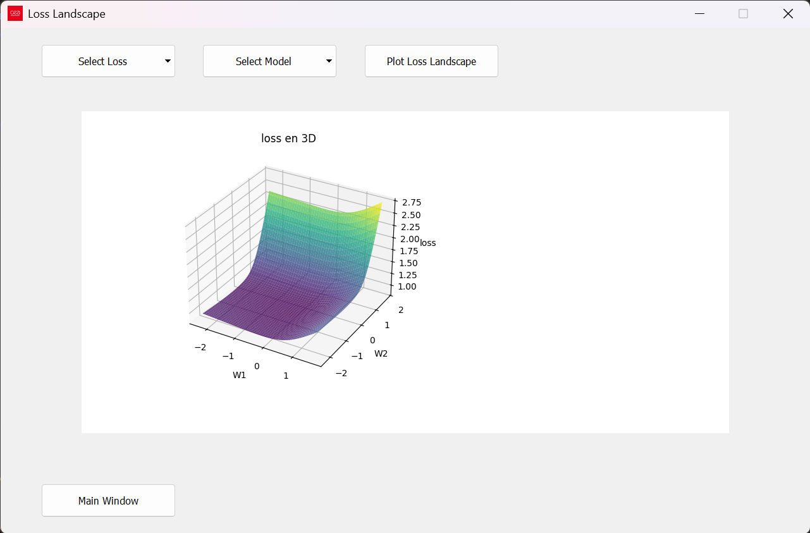  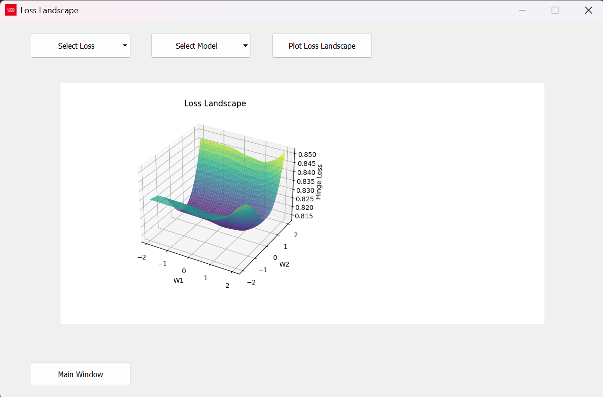

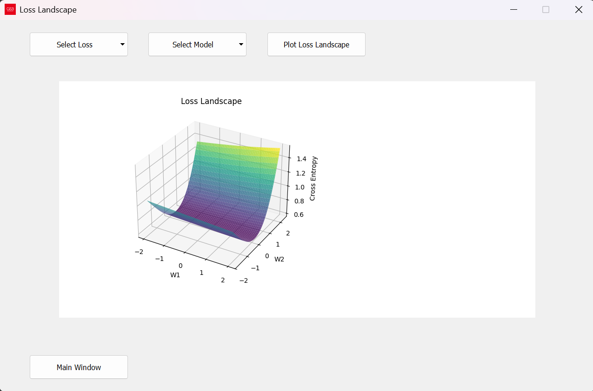

---
calcul des energies prédites par minimisation de MSE et de Fisher 
 


---
Calcul de Theta de Fisher
```python
def fisher_theta(Data : DataHolder, gradstr : str, forcestr: str, beta : float):
    keys  = list(Data.md_data.keys())   # getting each experience
    G_list, F_list, GGT =[], [], []     # list of gradient of descriptor, forces
    for key in keys :
        for atoms in Data.md_data[key]['atoms']:
            ...
    #computing theta based on Fisher
    c_mat = np.array([(beta**2)*np.dot(G_list[i].transpose(),F_list[i]) for i in range(len(G_list))])
    for G in G_list :
        GGT.append(np.dot(G.transpose(),G))
    c = np.mean(np.stack(c), axis = 0)
    T = np.mean(np.stack(GGT), axis=0) * beta**2
    
    theta_fisher = np.linalg.solve(T, c)
    return theta_fisher
```
---
Test de Kolmogorov-Smirnov
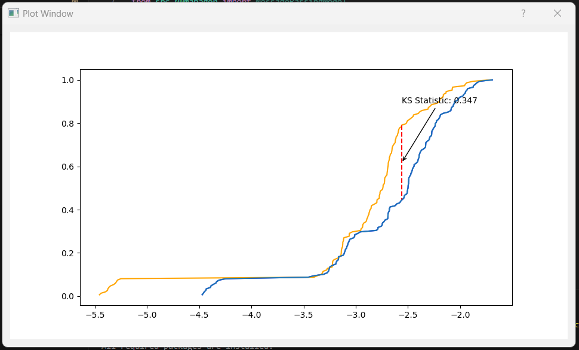


---
Message d'erreurs :
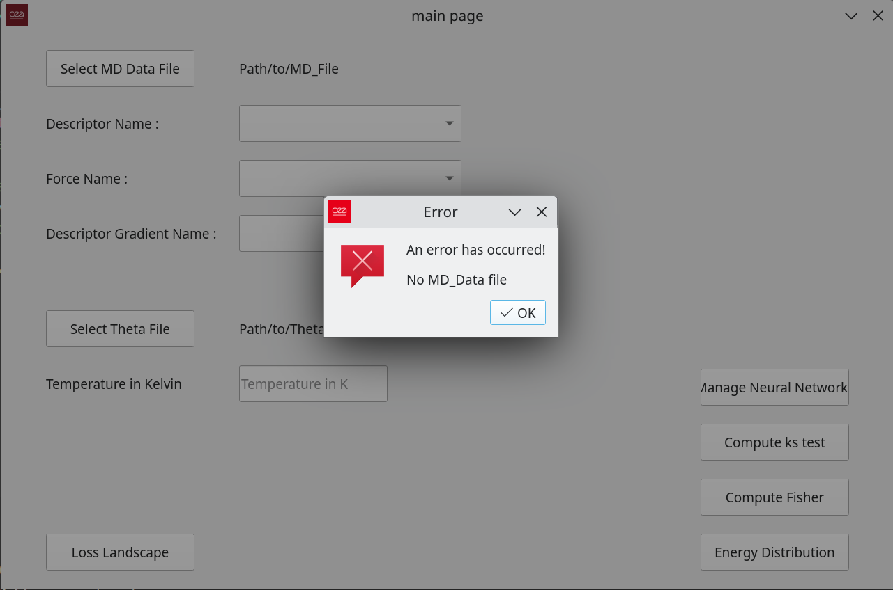 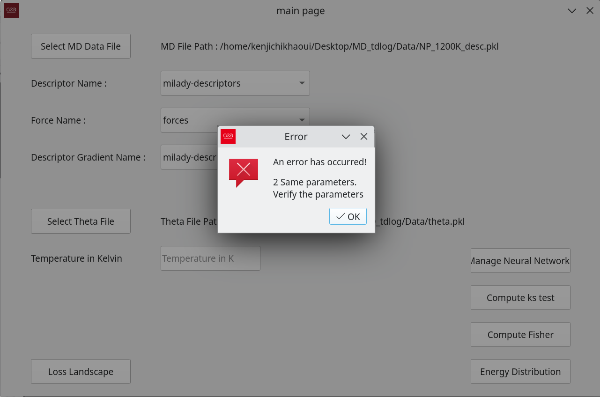

---
Neural Network manager  
(graphical interface and nn-holder separated)
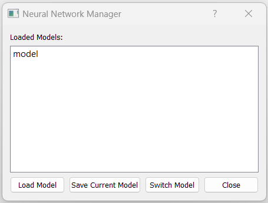

---
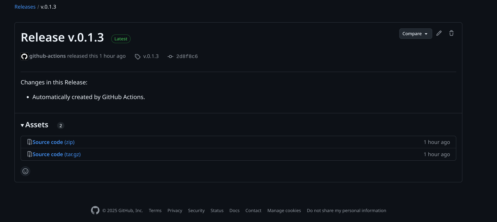

<!-- --- -->
<!-- loss landscape visualizer (interface) -->

---
### IV - Difficultés rencontrées
* partie scientifique
* généralisation des données
* cf. slides suivantes

---
#### tests et interface graphique
PyQt5 a besoin d'une interface graphique, non disponible sur GitHub Actions par défaut. 
```bash 
> pytest tests
============================================================= test session starts ==============================================================
platform win32 -- Python 3.11.4, pytest-8.3.4, pluggy-1.5.0
rootdir: C:\Users\Alexa\OneDrive\Bureau\MD\MD_tdlog
plugins: jaxtyping-0.2.36
collected 4 items

tests\test_QtGui.py .                                                                                                                     [ 25%]
tests\test_dataholder.py ...                                                                                                              [100%] 

============================================================== 4 passed in 0.41s ==============================================================
```

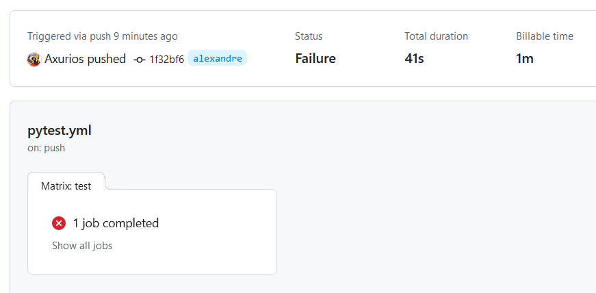

---
#### Difficultés pour le Loss Landscape
* Réseau de neurones final indisponibles : entraînement sur MNIST
* Choix des paramètres variables : aléatoire


---
### V - Perspectives d'extension
* Adapter Fisher aux GNN.
* Tester la stabilité après fine-tuning selon Fisher.
* Interface graphique pour construire son GNN.
* Choix des paramètres variables pour la Loss Landscape


 
<!--
```python
def merge_sort(seq):
    if len(seq) < 2:
        return seq
    else :
        mid = len(seq)//2
        left = merge_sort(seq[:mid])
        right = merge_sort(seq[mid:])
        return merge(lef, right)
        n = n-1
```
```python
def merge(seq1, seq2):
    # long à écrire mais tranquille
```
représentation en arbre (largeur n, profondeur log(n))

<!-- 
---
### Annexe 


---
en python : list = tableau dynamique (taille variable), d'habitude tableau statique 
(réallocation pour rendre dynamique)
nbr d'éléments != capacité
list.append()
list.insert(index=0, -1)

---
predicting the future by making it, on s'est restraint sur les éléments d'un 
ensemble dénombrable, problème d'applicabilité (mémoire)

> predicting the future by making it, on s'est restraint sur
>
>les éléments d'un ensemble dénombrable, problème d'applicabilité (mémoire)

predicting the future by making it, on s'est restraint sur les éléments d'un ensemble dénombrable, problème d'applicabilité (mémoire)

---
$\mathbb{P}_{\pi \,,\, p}(Y=y\,|\,X=x) = \frac{\pi(y) \, p(x|y)}{\sum_{y' \in Y} \pi(y') \, p(x|y')}$

$$
\begin{aligned}
x & xx \\
y & yy 
\end{aligned}
$$
<https://www.markdownguide.org>
<fake@example.com>

content: attr(data-marpit-pagination) '/' attr(data-marpit-pagination-total);
add in pagination style at beginning to make it a fraction

---
 paginate: false 
| Month    | Savings |
| -------- | ------- |
| January  | $250    |
| February | $80     |
| March    | $420    |


| Item              | In Stock | Price |
| :---------------- | :------: | ----: |
| Python Hat        |   True   | 23.99 |
| SQL Hat           |   True   | 23.99 |
| Codecademy Tee    |  False   | 19.99 |
| Codecademy Hoodie |  False   | 42.99 |

---
 -->